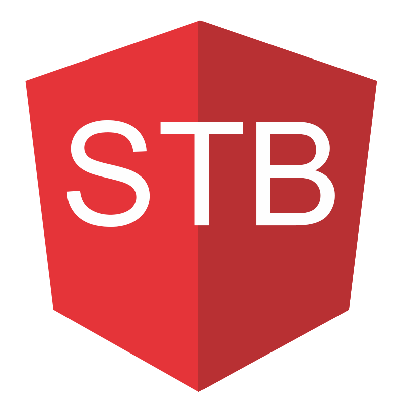
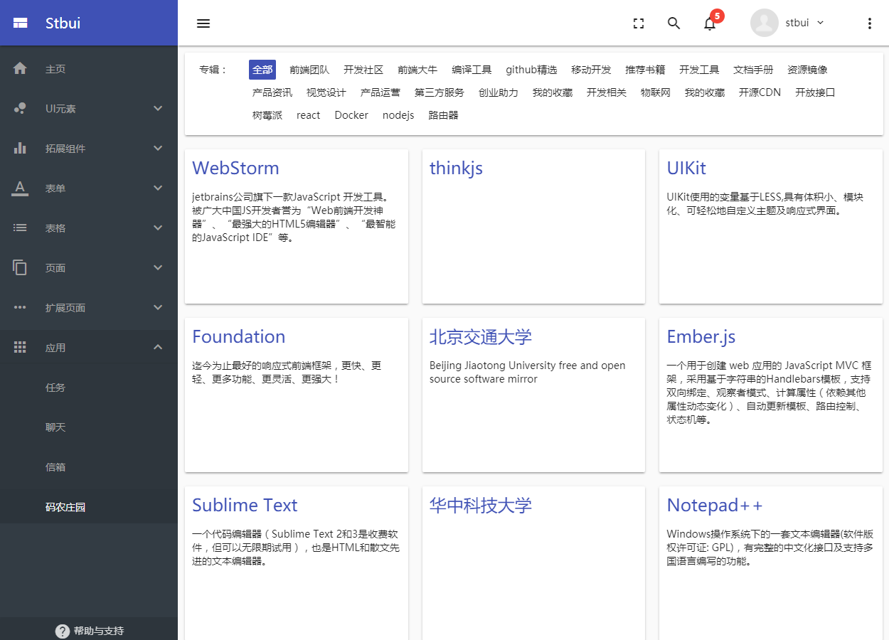

### Front-end application framework
 
 [ ](http://mnews.oss-cn-beijing.aliyuncs.com/angular6-material2-aws-sdk/index.html)
 [](https://surgeon-canary-67612.netlify.com/) [](https://oleglatypov.github.io/angular6-material2-aws-sdk/) [](https://translator-rhinoceros-87537.netlify.com/ )

<p align="center">
  <a href="./" target="blank"></a>
</p>

Based on the latest `Angular 6` framework and `Material 2` technology, the enterprise-level mid- and back-end front-end application framework covers a large number of common components and basic functions. You can quickly develop various MIS systems, such as CMS, OA, CRM, ERP, POS, etc., to the greatest extent help companies save time and expenses.

[](https://travis-ci.org/mnews/angular6-material2-aws-sdk)
[](https://hub.docker.com/ r/mnews/angular6-material2-aws-sdk/)
[](https://david-dm.org/mnews/angular -material-app)
[](https://david-dm.org/mnews/angular -material-app?type=dev)
[](https://gitter. Im/angular6-material2-aws-sdk/Lobby?utm_source=share-link&utm_medium=link&utm_campaign=share-link)
[](https://github.com/oleglatypov/angular6-material2-aws-sdk)


### Plaform

[](https://github.com/angular/angular)
[](https://github.com/angular/angular- Cli)
[](https://github.com/angular/material2)
[](https://github.com/angular/flex- Layout)
[](https://github.com/angular/angularfire2 )


### Feature

- Designed based on Material Design
- Multiple color schemes with multiple predefined color schemes
- Flex Layout powerful layout and support for responsive design
- Rich components, refining typical pages and scenes for background apps
- Module code, adding and removing is very easy
- Progressive application (PWA), closer to the native app experience
- Support docker to build images, rapid deployment, easy to use
- Support for electron building desktop applications
- Connect to firebase, build apps to provide a good user experience
- Irregular updates, using front-end leading edge technology to develop new features




### Get Start

```
Git clone --depth=1 https://github.com/oleglatypov/angular6-material2-aws-sdk.git
cd angular6-material2-aws-sdk
mpm install
npm run start
```

Open your browser and access
```
Http://127.0.0.1:4200
```

### Pubilsh

```
Npm run build
```
